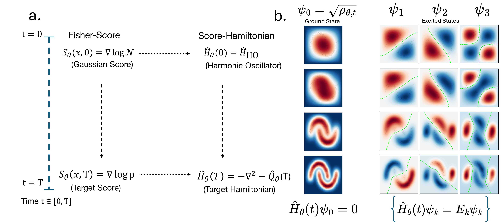
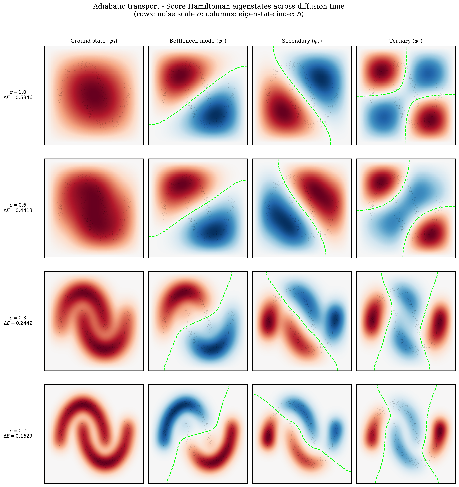
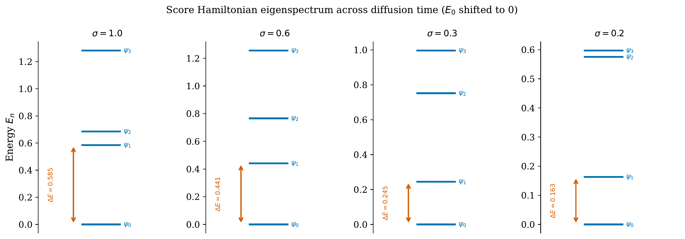

# The Score Hamiltonian

**"The Score Hamiltonian: Mapping Diffusion Models to Adiabatic Transport"**
[https://arxiv.org/abs/2606.05217](https://arxiv.org/abs/2606.05217)

 

This repository contains the numerical experiments demonstrating the theoretical results proven in the paper on real score-based diffusion models trained on simple and analytically tractable physical and non-physical densities. We introduce the **Score Hamiltonian**
$$\widehat{H}^\theta = -\nabla^2 + \tfrac{1}{2}\nabla\cdot S^\theta + \tfrac{1}{4}|S^\theta|^2$$
which is constructed from a diffusion model's inferred score $S^\theta$. When $S^\theta = \nabla \log \rho^{\theta}$ is conservative, this Hamiltonian has as its multplication potential the (negative) quantum potential $Q = -\frac{\nabla^{2}\sqrt{\rho^{\theta}}}{\sqrt{\rho^{\theta}}}$ (Madelung 1927, Bohm 1952) of the score's density according to the score-based expansion of the quantum potential (a classical identity, in e.g. Nelson 1966, Fiscaletti 2017, and Sbitnev 2009). 

The ground-state of $\widehat{H}^{\theta}$ is thus exactly the model's inferred density amplitude $\sqrt{\rho^{\theta}}$, and our paper proves that the annealing process of a diffusion model along 

$$\left( \rho_{t}^{\theta} \right)_{t \in [0,T]}$$ 

is exactly mapped to an adiabatic transport on the associated Score Hamiltonian schedule 

$$\left( \widehat{H}_{t}^{\theta} \right)_{t \in [0,T]}$$ 

for the diffusion time $t \in [0, T]$ that indexes the process between the endpoints of an initial Gaussian density and a terminal data density. By Thm. 2, this offers a spectral decomposition of diffusion model generation in terms of the misalignment to the initial density $\mu^{(0)}$, the annealing schedule $\dot{t}$, and the Hamiltonian's spectral gap $\Delta(t)$, which constitutes a speed limit for sampling and provides an irreducible floor for the hardness of diffusion model generation.

Visually, this also offers a practical spectral view of the reverse process for arbitrary densities learned by diffusion models. As an example, for a simple variance-preserving (Song '21) reverse diffusion one can visualize the eigenfunctions of the Score Hamiltonian and the associated eigenspectrum to analyze the dynamics of the spectrum and its gap $\Delta(t)$ through diffusion time. The ground state represents the density, the first excited state $\psi_{1}$ the hardest bottleneck mode of the density, and the higher excited states $\psi_{k \geq 2}$ representing the higher-order modes resolved during diffusion:

 

 

---

The project is organized into modular source code and standalone experimentation notebooks. In particular, the source code `src/` contains:

| File | Description |
| :--- | :--- |
| `models.py` | Neural network architectures for parametrizing the neural scores $S^{\theta}$. |
| `hamiltonian.py` | Score Hamiltonian construction, spectral gap estimation, and potential extraction. |
| `training.py` | Training loops for denoising score matching, implicit score matching, and MLE flows. |
| `density_sampler.py` | Exact samplers for physical systems (Hydrogen, coupled oscillator, GMMs). |
| `utils.py` | Generation metrics, reverse Euler-Maruyama SDE samplers, and an adiabatic schedule builder. |

Notebooks resolve `src/` via a `sys.path` insertion at the top of each file, and the experiments of `numerical_experiments/` contain:

| Notebook | Description |
| :--- | :--- |
| `HydrogenAtom.ipynb` | Identifies the potential and recovers excited-state energies $E_n = -1/(2n^2)$ and orbital shapes from 1s ground-state samples only via the Score Hamiltonian computed from a network trained via score-matching. |
| `Coupled_HO.ipynb` | Compares Score Hamiltonian, thermodynamic integration, and Boltzmann generator performance on potential and normal-mode frequency recovery for a 2D coupled oscillator. |
| `SpectralTest_A.ipynb` | Validates three theoretical bounds on a 2D Gaussian mixture: spectral floor $\propto \epsilon_\theta/\sqrt{\Delta E}$, adiabatic tracking error vs. schedule speed, and the terminal non-conservativity penalty $\propto\sqrt{2\lambda_\theta/\Delta E}$. |
| `SpectralTest_B.ipynb` | Replication of `SpectralTest_A` with $n=4$ independent runs per condition and exact eigenvalue computation of the ground-state $\lambda_\theta$. |
| `Eigenmodes_ScoreModel.ipynb` | Visualizes the eigenstates and adiabatic eigenspectrum evolution of $\widehat{H}_\theta$ along the reverse diffusion path on the Two Moons dataset. |

